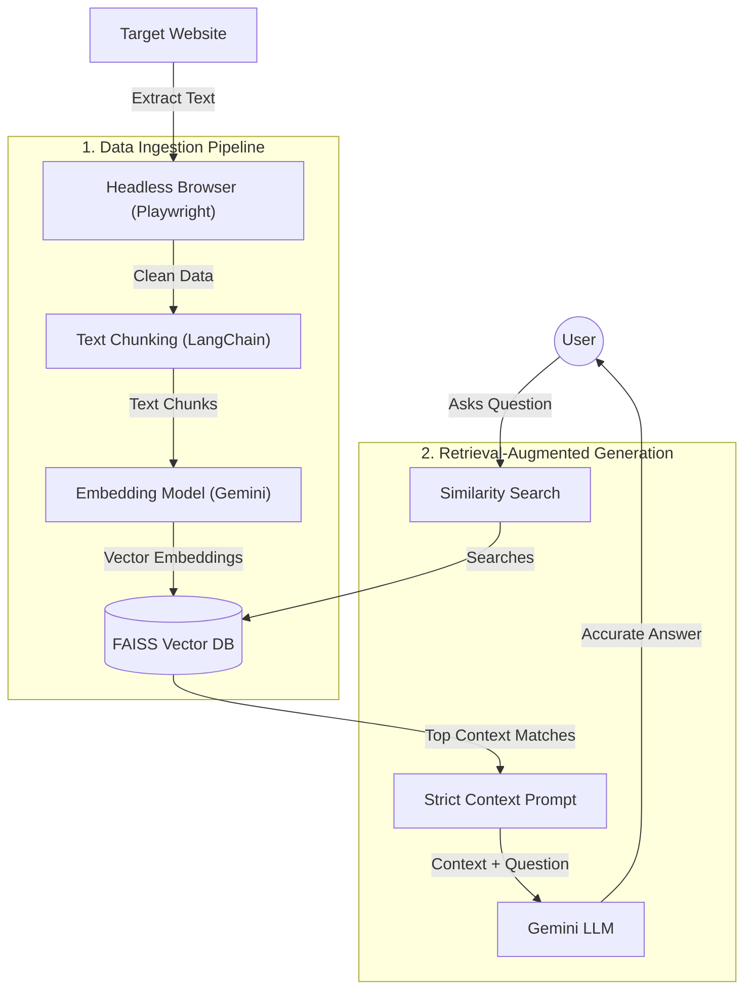

# SiteMind AI 🧠✨

SiteMind AI is a simple, **Retrieval-Augmented Generation (RAG)** web application that allows users to instantly chat with the contents of any website. 

By pasting a URL, the system dynamically scrapes, processes, and embeds the website's text into a local vector database. Users can then ask highly specific questions, and the AI will answer accurately using *only* the retrieved context from the website, completely eliminating AI hallucinations.

## ✨ Features
*   **Playwright Headless Browsing:** Spawns an invisible Chromium browser to execute JavaScript and perfectly scrape modern Single Page Applications (React, Next.js, Angular).
*   **RAG Pipeline:** Uses LangChain for intelligent semantic text chunking.
*   **Vector Caching:** Utilizes Facebook's FAISS for lightning-fast similarity search and local vector storage.
*   **Conversational Memory:** Remembers the context of previous messages, allowing users to ask natural follow-up questions.
*   **Real-Time SSE Streaming:** Answers are streamed to the frontend word-by-word instantly, mimicking the premium UX of ChatGPT.
*   **Multi-Tenant Architecture:** Secure Flask backend with isolated user accounts and independent vector databases per user.
*   **Premium Neumorphic UI:** A stunning, fully responsive frontend featuring 3D claymorphic buttons, gold and black luxury gradients, and hardware-accelerated CSS animations.
*   **Zero Hallucinations:** Powered by Google's Gemini LLM, bound by a strict prompt template to only answer using the retrieved website context.

## 🛠️ Technology Stack
*   **Backend:** Python, Flask, SQLite, Server-Sent Events (SSE)
*   **AI / Machine Learning:** LangChain, Google Gemini API (LLM & Embeddings), FAISS Vector DB
*   **Web Scraping:** Playwright (Headless Chromium), BeautifulSoup4
*   **Frontend:** HTML5, Vanilla CSS (Neumorphism), JavaScript

## 🏗️ System Architecture



## ⚠️ Limitations & Scope
While SiteMind AI is highly effective for processing modern dynamic web apps, documentation, and blogs, there are some hard limits to web scraping: 
*   **Security Blocks:** Highly-secured websites or platforms with aggressive anti-bot protections (like Cloudflare, Captchas, or strict paywalls) may detect and block the Playwright headless browser.

## 🚀 Local Installation & Setup

1. **Clone the repository**
   ```bash
   git clone https://github.com/yourusername/sitemind-ai.git
   cd sitemind-ai
   ```

2. **Set up your API Key**
   You will need a Google Gemini API key. Set it as an environment variable in your terminal:
   ```bash
   # Windows
   set GOOGLE_API_KEY="your_api_key_here"
   
   # Mac/Linux
   export GOOGLE_API_KEY="your_api_key_here"
   ```

3. **Install Dependencies**
   It is recommended to use a virtual environment.
   ```bash
   pip install -r requirements.txt
   playwright install chromium
   ```
   *(Ensure you have flask, langchain, google-generativeai, faiss-cpu, playwright, and beautifulsoup4 installed)*

4. **Run the Server**
   ```bash
   python server.py
   ```
   The application will be running at `http://127.0.0.1:5000`.

## 🤝 Contributing
Contributions, issues, and feature requests are welcome! Feel free to check the issues page.
